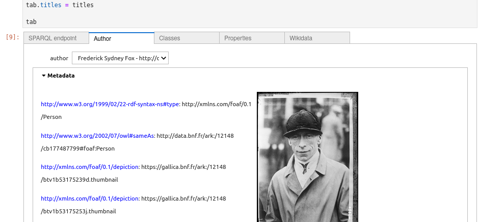
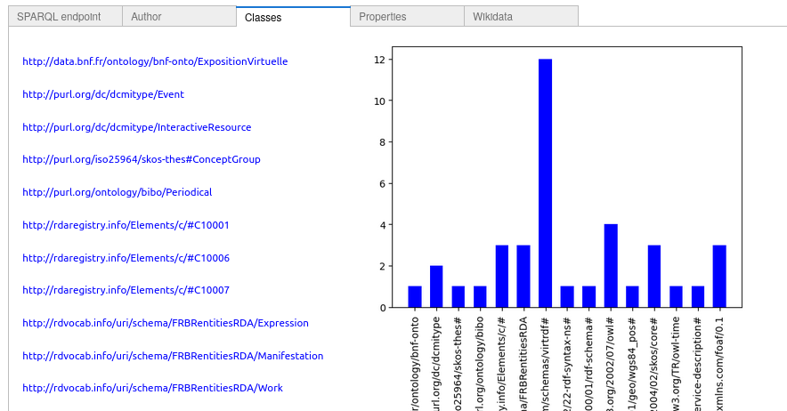
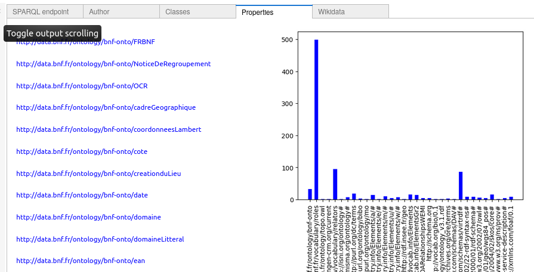
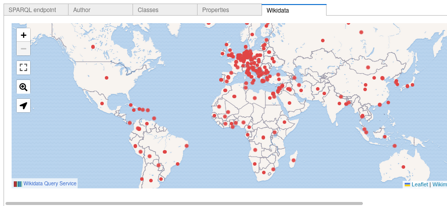

## Linked Open Data visualization in CH
An example of tool based on Jupyter Notebooks to visualize LOD repositories made available by CH institutions. 

## Data modelling
The tool uses a [dataset.ttl](data repository) with metadata about the LOD repositories based on controlled vocabularies such as [https://schema.org/](Schema.org), foaf and Wikidata. 

## LOD repositories used

The tool has been applied to three LOD repositories:

- National Library of the Netherlands, http://data.bibliotheken.nl/sparql
- National Library of France, https://data.bnf.fr/sparql
- Getty Vocabularies, https://data.getty.edu/vocab/sparql

## Interface

The interface was implemented using [https://jupyter.org/](Jupyter Notebooks) and several Python software libraries such as [https://ipywidgets.readthedocs.io/](ipywidgets), [https://networkx.org/](networkx), [https://matplotlib.org/](matplotlib), [https://rdflib.readthedocs.io/](rdflib) and [https://sparqlwrapper.readthedocs.io/](SPARQLWrapper).

The interface provides several views to explore the metadata provided by the LOD repositories. In particular, the interface provices a [https://ipywidgets.readthedocs.io/en/latest/examples/Widget%20List.html#tag-widgets](tab widget) with several options such as explore the properties and classes. An additional view is provided to browse the metadata using innovative features provided by the Wikidata SPARQL endpoint.

## References

- Esko Ikkala, Eero Hyvönen, Heikki Rantala, Mikko Koho: Sampo-UI: A full stack JavaScript framework for developing semantic portal user interfaces. Semantic Web 13(1): 69-84 (2022)
- Martin Necaský, Stepán Stenchlák: Interactive and iterative visual exploration of knowledge graphs based on shareable and reusable visual configurations. J. Web Semant. 73: 100713 (2022)
- Federico Desimoni, Laura Po: Empirical evaluation of Linked Data visualization tools. Future Gener. Comput. Syst. 112: 258-282 (2020)
- Padilla, T., Scates Kettler, H., Varner, S., & Shorish, Y. (2023). Vancouver Statement on Collections as Data. Zenodo. https://doi.org/10.5281/zenodo.8342166
- Mahendra Mahey, Aisha Al-Abdulla, Sarah Ames, Paula Bray, Gustavo Candela, Caleb Derven, Milena Dobreva-McPherson, Katrine Gasser, Sally Chambers, Stefan Karner, Kristy Kokegei, Ditte Laursen, Abigail Potter, Armin Straube, Sophie-Carolin Wagner, and Lotte Wilms. 2019. Open a GLAM lab. International GLAM Labs Community, Book Sprint, Doha, Qatar. 164 pages. https://doi.org/10.21428/16ac48ec.f54af6ae
- Gustavo Candela, Nele Gabriëls, Sally Chambers, Milena Dobreva, Sarah Ames, Meghan Ferriter, Neil Fitzgerald, Victor Harbo, Katrine Hofmann, Olga Holownia, Alba Irollo, Mahendra Mahey, Eileen Manchester, Thuy-An Pham, Abigail Potter, and Ellen Van Keer. 2023. A checklist to publish collections as data in GLAM institutions. Global Knowledge, Memory and Communication (Nov. 2023). https://doi.org/10.1108/gkmc-06-2023-0195
- Gustavo Candela. 2023. An automatic data quality approach to assess semantic data from cultural heritage institutions. J. Assoc. Inf. Sci. Technol. 74, 7 (2023), 866–878. https://doi.org/10.1002/ASI.24761
- Gustavo Candela. 2023. Towards a semantic approach in GLAM Labs: The case of the Data Foundry at the National Library of Scotland. Journal of Information Science (2023). https://doi.org/10.1177/01655515231174386 
- Gustavo Candela, Sally Chambers, and Tim Sherratt. 2023. An approach to assess the quality of Jupyter projects published by GLAM institutions. Journal of the Association for Information Science and Technology 74, 13 (2023), 1550–1564. https://doi.org/10.1002/asi.24835
